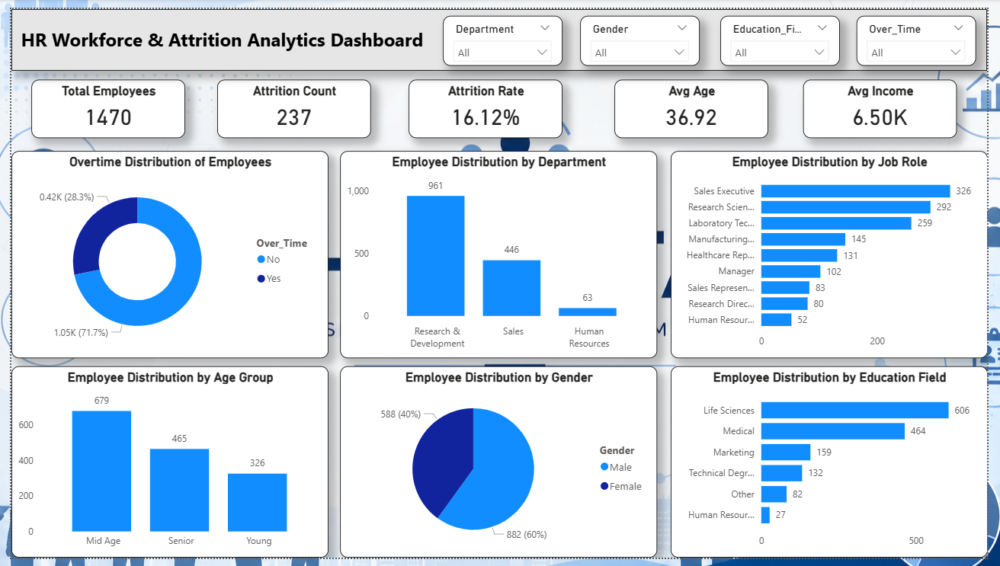

# HR Workforce & Attrition Analytics Dashboard

## Project Overview

This project analyzes employee workforce and attrition data to identify workforce distribution patterns and employee turnover trends. The dashboard provides insights into employee demographics, departmental distribution, job roles, age groups, gender diversity, education fields, and attrition metrics.

## Objectives

* Analyze workforce distribution across departments and job roles.
* Measure employee attrition and retention trends.
* Understand employee demographics and workforce composition.
* Create an interactive HR analytics dashboard for business decision-making.

## Tools Used

* Microsoft Excel
* Power BI

## Dataset Information

The dataset contains information for **1,470 employees**, including:

* Age
* Gender
* Department
* Job Role
* Education Field
* Monthly Income
* Overtime Status
* Attrition Status
* Work Experience Details

## Excel Analysis

Performed data cleaning and exploratory analysis using:

* Pivot Tables
* Pivot Charts
* Employee Distribution Analysis
* Attrition Analysis
* Workforce Demographic Analysis

## Power BI Dashboard Features

### KPI Cards

* Total Employees
* Attrition Count
* Attrition Rate
* Average Age
* Average Income

### Visualizations

* Overtime Distribution of Employees
* Employee Distribution by Department
* Employee Distribution by Job Role
* Employee Distribution by Age Group
* Employee Distribution by Gender
* Employee Distribution by Education Field

### Interactive Filters

* Department
* Gender
* Education Field
* Overtime Status

## Key Insights

* Total Employees: 1,470
* Attrition Count: 237
* Attrition Rate: 16.12%
* Research & Development has the largest workforce.
* Sales Executive and Research Scientist are among the largest job roles.
* Most employees belong to the Life Sciences education field.
* The workforce is primarily composed of male employees.
* Employees not working overtime represent the majority of the workforce.

## Dashboard Preview

Add the dashboard screenshot below:

## Dashboard Preview

## Project Outcome

This dashboard helps HR teams monitor workforce composition, employee demographics, and attrition metrics, enabling data-driven workforce planning and decision-making.

---

### Author

**Karan Kadam**

Data Analyst Aspirant

GitHub: https://github.com/datawithkaran

